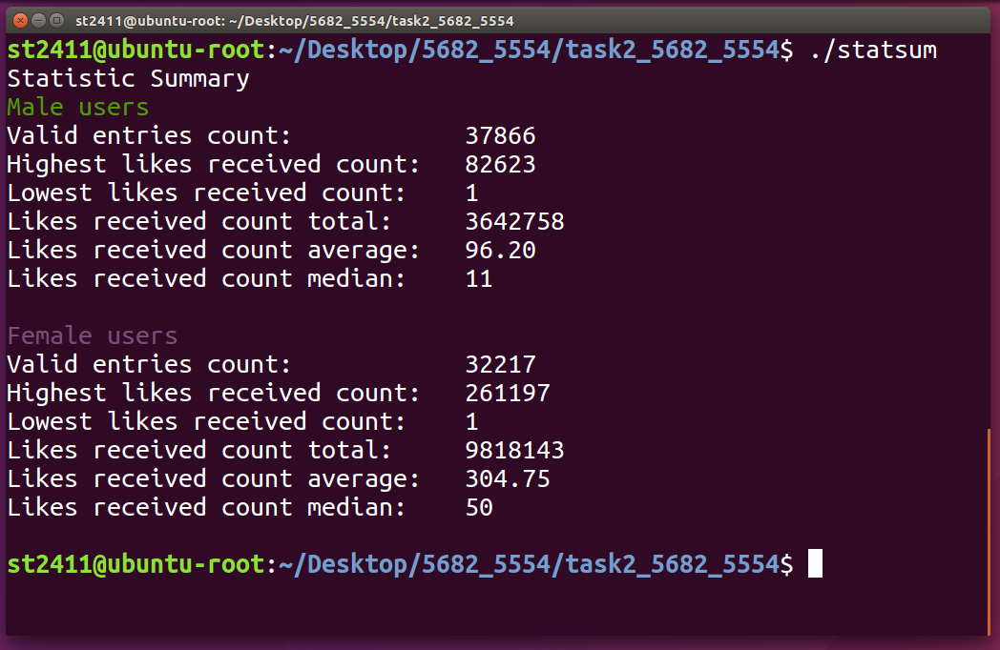

# Survey Statistics Report

***Survey Statistics Report*** is a C program to read in a Facebook survey dataset and print out a statistic summary report. The statistic figures are grouped into two
different genders and will include valid entry count, highest likes received count, lowest likes received count, likes received count total,
likes received count average and likes received count median.

## Preview

## Usage

1. Clone this repository into any directory. 

2. Enter the "survey-statistics-report" directory by typing `cd survey-statistics-report`.

3. Compile the program by typing `gcc statsum.c statsumsrc.c -o statsum -Wall`. 

4. Run the program by typing `./statsum`.

## Acknowledgements

- **Chua Han Yong Darren** | [@chydarren](https://github.com/chydarren)
- **Chng Wei Cheng**

## Credits

This program was developed as an assignment for the Singapore Polytechnic, ST2411 Programming in Python and C module. I have uploaded the source files publicly for reference and personal usage only. Please refrain from [plagiarising](https://www.sp.edu.sg/sp/student-services/ssc-overview/student-handbook/intellectual-property-copyright-and-plagiarism) or passing it off as your own work. 

Chua Han Yong Darren © 2017. Code released under the GNU Affero General Public License v3.0.
